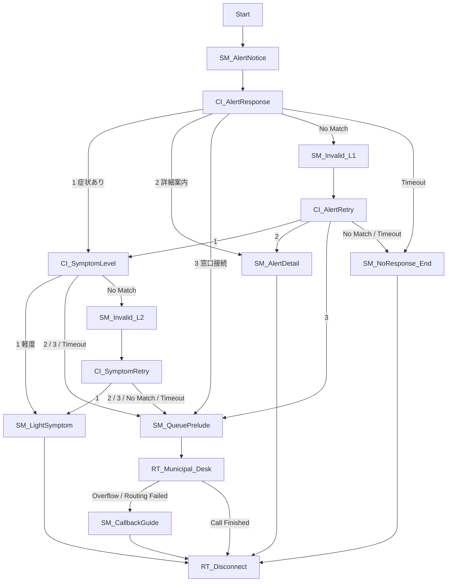

# Agentless Dialer 光化学スモッグ注意報デモ設定手順

Zoom Contact Center（ZCC）のAgentless Dialerで、同意済みテスト端末1件へ光化学スモッグ注意報を発信し、ダイヤルキー操作で担当Queueへ接続するデモを構築します。

本手順は2026年9月3日にZoom Webポータルの実画面で作成し、1件の実通話で接続を確認した構成を一般化したものです。画面名や選択肢はZoomの更新や契約によって変わるため、実画面が異なる場合は推測で進めず、末尾の公式資料を確認してください。

## 完了状態

次の状態を完了とします。

- デモ専用Voice Queueが作成されている
- 同意済みテスト端末1件だけのContact Listが作成されている
- Contact List Custom Fieldの`alert_time`と`alert_level`が登録されている
- 15ウィジェットのVoice Flowに未接続Exitがない
- Campaign固有カレンダーを持たないAgentless Dialer Campaignが作成されている
- Caller IDが対象Voice FlowのEntry Pointに関連付けられている
- PublishとRunがそれぞれ明示承認後に実行されている
- 1件の診断結果とEngagement IDが記録されている
- 実行後のCampaignが`完了済み`または`一時停止`である

## 安全ルール

作業前に次のルールを合意します。

- 実在住民の電話番号や個人情報を使用しない
- 発信先は所有者がテスト発信へ明示同意した番号1件だけにする
- 電話番号はE.164形式で管理し、手順書や画面キャプチャでは末尾4桁以外をマスクする
- 既存の本番Queue、Flow、Campaign、Contact List、電話番号割り当てを削除または上書きしない
- 課金契約、番号購入、ライセンス変更、既存番号の再割り当てはこの手順では行わない
- 最大同時発信数は1、最大試行回数は1、Always runningはOffにする
- PublishとRunは別の外部影響として扱い、各操作前に明示承認を得る
- Runを複数回押さない
- 録音、文字起こし、保持期間は変更しない

同名資産が存在しても、内容が完全一致すると確認できるまでは再利用しません。既存資産か判断できない場合は、名前へ`-DEMO-YYYYMMDD-HHMM`を付けて別途作成します。

## 1. 入力値を確定する

Zoom Webポータルへ書き込む前に、次の値を1回で揃えます。

| 項目 | 入力例 | 条件 |
| --- | --- | --- |
| 自治体名 | `未来市` | 音声で読み上げる正式名称 |
| テスト電話番号 | `+81...` | E.164、1件、所有者の同意確認済み |
| Agent | `<agent-email>` | 管理画面で一意に選べるメールアドレス |
| Caller ID | `+81...` | 既存のZCC番号。新規購入しない |
| `alert_time` | `14:30` | 読み上げる発令時刻。Campaign開始時刻ではない |
| `alert_level` | `注意報` | `注意報`または`警報` |

このデモではCampaign固有の開始・終了日時を設定しません。Run押下後に即時発信できるよう、アカウント既定の営業時間内で作業します。アカウント既定営業時間が現在時刻を含まない場合は、アカウント全体の設定を無断変更せず、管理者へ確認します。

## 2. 利用条件を事前確認する

### 2.1 権限と契約

Zoom Webポータルへ管理者としてサインインし、次を確認します。

- Campaign Managementを表示できる
- Queuesを表示・作成できる
- Flowsを表示・作成できる
- Agentless DialerをCampaign種別として選択できる
- 対象AgentにZCCライセンスがあり、状態がActiveである

Zoom公式では、Agentless Dialerに管理権限、Agentless Dialer add-on、ZCC Essential、Premium、またはEliteライセンスが必要です。画面が表示されることだけで契約明細を断定せず、不足が疑われる場合は契約管理者へ確認します。

### 2.2 発信先の国・地域

対象国・地域へのCall Outが許可されていることを確認します。全件が`失敗`となり`スキップ`が0件の場合は、Contact Listより先にBillingまたは通話設定のCall Out許可を確認します。

Call Out設定の変更は課金やアカウント全体へ影響する可能性があります。必要な国・地域が無効でも、権限と承認がなければ変更せず停止します。

### 2.3 Caller ID

`Admin Center` → `Product configuration` → `Numbers` → `Phone Numbers`で対象番号を検索します。

次を確認します。

- ProductがContact Centerである
- CapabilityにOutgoing Callがある
- 対象Voice FlowのEntry Pointへ割り当て可能である
- 既存の本番Voice Flowを置き換えない

番号が別のVoice Flowへ割り当て済みで、追加ではなく置換になる場合は作業を停止します。利用可能な別番号を選ぶか、番号管理者の明示承認を得てください。

### 2.4 Agent

`Contact Center Management` → `Users`で、対象メールアドレスのユーザーを検索します。

次を確認します。

- StatusがActiveである
- Voiceを処理できるZCCライセンスがある
- 後で作成するDemo Queueへ追加できる
- テスト時にZoom Desktop AppのContact Centerを開始できる

## 3. Demo Queueを作成する

`Contact Center Management` → `Queues` → `Add Queue`を開きます。

| 項目 | 設定値 |
| --- | --- |
| Name | `Q_Environmental_Health_DEMO` |
| Description | `Agentless Dialer 光化学スモッグ注意報デモ専用` |
| Channel | `Voice` |
| Agents | 入力値で確定したAgent 1名 |

保存後、Queue設定を開いて次を設定・確認します。

| 項目 | 設定値 |
| --- | --- |
| Max Wait Duration | `300`秒 |
| Outbound Calls | On |
| Agent | 1名 |
| Supervisor | 必要がなければ追加しない |

録音、文字起こし、通知、保持期間はアカウント継承値を読み取るだけにし、このデモのために変更しません。保存後にQueue一覧から開き直し、Channel、Agent、Max Waitが残っていることを確認します。

## 4. Contact ListとCustom Fieldを作成する

### 4.1 Contact List

`Contact Center Management` → `Campaign Management` → `Contacts` → `Create List`を開きます。

| 項目 | 設定値 |
| --- | --- |
| Name | `CL_PhotochemSmog_DEMO` |
| Description | `同意済みテスト番号のみ。実在住民データ禁止` |

保存後、対象Listを開きます。

### 4.2 Custom Field

Outbound Contact ListのCustom Fieldとして次の2件を作成します。Address BookのCustom Fieldは使用しません。

| Field name | Type | 値 |
| --- | --- | --- |
| `alert_time` | 文字列 | 例: `14:30` |
| `alert_level` | 選択リスト | `注意報`、`警報` |

UIに選択リストがない場合は文字列を使用できますが、存在しない型を推測して作成しません。保存後にField名と型を開き直して確認します。

### 4.3 CSV

対象Listの`Import` → `Upload CSV file`から`Download CSV Sample`を実行します。CSVヘッダーは必ずその時点のZoomテンプレートを正とし、手入力でゼロから作りません。

ダウンロードしたテンプレートへ次を設定します。

- Contactは1行だけにする
- Display Name、First Name、Last Nameをテスト用の値にする
- Phone Numberは同意済み番号をE.164で入れる
- Time Zoneは`Asia/Tokyo`にする
- Languageは`Japanese`にする
- `alert_time`と`alert_level`をCustom Field名と完全一致する列名で追加する

CSVをアップロードした後、処理成功の表示だけで完了にしません。Contact Listを再読み込みし、登録件数1、電話番号末尾4桁、`alert_time`、`alert_level`を画面で確認します。

## 5. Voice Flowを作成する

`Contact Center Management` → `Flows` → `Add Flow`を開きます。

| 項目 | 設定値 |
| --- | --- |
| Name | `PhotochemSmog_Alert_Flow_DEMO` |
| Description | `未来市 光化学スモッグ注意報 Agentless Dialer デモ専用` |
| Channel | `Voice` |

作成中はDraftのまま保存し、Publishしません。

### 5.1 共通音声設定

すべてのSend MediaとCollect Inputで、利用可能な同一の日本語音声を使用します。2026年9月3日に確認したテナントでは次の値を使用しました。

| 項目 | 設定値 |
| --- | --- |
| Media Type | Audio |
| Audio source | Text To Speech |
| Language | 日本語（日本） |
| Voice | Takumi |

Voice名が表示されない場合は、同じ日本語音声を選び、その名前を記録します。

### 5.2 Flow構造

次の15ウィジェットを作成します。



`End`という未確認のノードは使用せず、終話は`Route To`ウィジェットの`Disconnect`で作成します。

### 5.3 ウィジェットを設定する

#### `SM_AlertNotice`

種類は`Send Media`です。

```text
こちらは未来市役所です。本日、〔alert_time〕に、光化学スモッグ〔alert_level〕が発令されました。屋外での激しい運動はお控えください。続いて、体調とご希望を確認します。
```

`alert_time`と`alert_level`は文字列として手入力しません。メッセージ編集欄の`/`または`Insert`から`Contact Attributes` → `Contact List Custom Fields`を開き、変数ピッカーで選択します。保存後の実画面では、次のトークンとして認識されます。

- `{{contactList.customField.alert_time}}`
- `{{contactList.customField.alert_level}}`

Next Stepは`CI_AlertResponse`、Send Media Failedは`RT_Disconnect`へ接続します。

#### `CI_AlertResponse`

種類は`Collect Input`の`Menu`です。

| 項目 | 設定値 |
| --- | --- |
| Keypress input | On |
| Voice input | Off |
| Max Wait Duration | 15秒 |
| Repeat prompt | 2 |

```text
目や喉に異常を感じている方は1を、注意事項の詳しい案内を聞く方は2を、担当窓口への接続を希望する方は3を押してください。
```

| Exit | 接続先 |
| --- | --- |
| 1 | `CI_SymptomLevel` |
| 2 | `SM_AlertDetail` |
| 3 | `SM_QueuePrelude` |
| No Match | `SM_Invalid_L1` |
| Timeout | `SM_NoResponse_End` |
| Send audio failed | `RT_Disconnect` |
| Speech model errorが表示される場合 | `RT_Disconnect` |

#### `SM_Invalid_L1`と`CI_AlertRetry`

`SM_Invalid_L1`は`Send Media`です。

```text
入力を確認できませんでした。もう一度ご案内します。
```

Next Stepは`CI_AlertRetry`、Send Media Failedは`RT_Disconnect`です。

`CI_AlertRetry`は`CI_AlertResponse`と同じ案内文を使います。ウィジェット名の上限に収めるため、この短縮名を使用します。

| 項目 | 設定値 |
| --- | --- |
| Keypress input | On |
| Voice input | Off |
| Max Wait Duration | 15秒 |
| Repeat prompt | 0 |

| Exit | 接続先 |
| --- | --- |
| 1 | `CI_SymptomLevel` |
| 2 | `SM_AlertDetail` |
| 3 | `SM_QueuePrelude` |
| No Match / Timeout | `SM_NoResponse_End` |
| Send audio failed | `RT_Disconnect` |
| Speech model errorが表示される場合 | `RT_Disconnect` |

No Matchを同じCollect Inputへ戻さず、再案内は1回で終了させます。

#### `SM_NoResponse_End`

種類は`Send Media`です。

```text
入力を確認できなかったため、この通話を終了します。必要な場合は、市の公式窓口へお電話ください。
```

Next StepとSend Media Failedは`RT_Disconnect`です。

#### `CI_SymptomLevel`

種類は`Collect Input`の`Menu`です。

| 項目 | 設定値 |
| --- | --- |
| Keypress input | On |
| Voice input | Off |
| Max Wait Duration | 15秒 |
| Repeat prompt | 2 |

```text
症状の程度をお聞かせください。目の痛みや軽い喉の違和感など軽度の症状の方は1を、呼吸が苦しい、または強い頭痛などの症状がある方は2を押してください。緊急性がある場合は、この電話を切って119番へ連絡してください。
```

| Exit | 接続先 |
| --- | --- |
| 1 | `SM_LightSymptom` |
| 2 | `SM_QueuePrelude` |
| 3がUIに残る場合 | `SM_QueuePrelude` |
| No Match | `SM_Invalid_L2` |
| Timeout | `SM_QueuePrelude` |
| Send audio failed | `RT_Disconnect` |
| Speech model errorが表示される場合 | `RT_Disconnect` |

#### `SM_Invalid_L2`と`CI_SymptomRetry`

`SM_Invalid_L2`は`Send Media`です。

```text
入力を確認できませんでした。もう一度ご案内します。
```

Next Stepは`CI_SymptomRetry`、Send Media Failedは`RT_Disconnect`です。

`CI_SymptomRetry`は`CI_SymptomLevel`と同じ案内文を使います。

| 項目 | 設定値 |
| --- | --- |
| Keypress input | On |
| Voice input | Off |
| Max Wait Duration | 15秒 |
| Repeat prompt | 0 |

| Exit | 接続先 |
| --- | --- |
| 1 | `SM_LightSymptom` |
| 2 / 3 / No Match / Timeout | `SM_QueuePrelude` |
| Send audio failed | `RT_Disconnect` |
| Speech model errorが表示される場合 | `RT_Disconnect` |

No MatchまたはTimeout後にQueueへ接続する動作は、このデモで安全側に倒した設計であり、Zoomの標準動作ではありません。

#### `SM_AlertDetail`

種類は`Send Media`です。

```text
光化学スモッグ注意報発令中の注意事項をお伝えします。屋外での激しい運動はお控えください。目や喉に刺激を感じた場合は、屋内へ移動し、市が案内する対処方法をご確認ください。症状が続く、または悪化する場合は、医療機関や市の相談窓口へご相談ください。以上でご案内を終了します。
```

Next StepとSend Media Failedは`RT_Disconnect`です。

#### `SM_LightSymptom`

種類は`Send Media`です。

```text
屋内へ移動して安静にし、市が案内する対処方法をご確認ください。症状が続く、または悪化する場合は、医療機関や市の相談窓口へご相談ください。以上でご案内を終了します。
```

Next StepとSend Media Failedは`RT_Disconnect`です。

#### `SM_QueuePrelude`

種類は`Send Media`です。

```text
担当窓口へおつなぎします。そのままお待ちください。呼吸が苦しいなど緊急性がある場合は、この電話を切って119番へ連絡してください。
```

Next Stepは`RT_Municipal_Desk`、Send Media Failedは`RT_Disconnect`です。

#### `RT_Municipal_Desk`

種類は`Route To`です。

| 項目 | 設定値 |
| --- | --- |
| Route To | Queue |
| Queue | `Q_Environmental_Health_DEMO` |
| Call Finished | `RT_Disconnect` |
| Overflow | `SM_CallbackGuide` |
| Routing Failed | `SM_CallbackGuide` |

Queueの待機時間はQueue側の設定を正とします。画面に存在しない優先度や待機音楽の項目を仮定しません。

#### `SM_CallbackGuide`

種類は`Send Media`です。

```text
ただいま担当窓口へ接続できません。お手数ですが、市の公式窓口へおかけ直しください。緊急性がある場合は119番へ連絡してください。この通話を終了します。
```

Next StepとSend Media Failedは`RT_Disconnect`です。

#### `RT_Disconnect`

種類は`Route To`です。Route Toで`Disconnect`を選択します。切断前の案内は直前のSend Mediaで行い、このウィジェットに存在しない案内機能を仮定しません。

### 5.4 Draftを検証する

保存後、Flow一覧から同じversionを開き直します。

次を確認します。

- 15ウィジェットが存在する
- すべてのNext Stepが接続されている
- Send Media Failedがすべて`RT_Disconnect`へ接続されている
- Collect InputのTimeoutとNo Matchが別Exitである
- No Matchに無限自己ループがない
- QueueのOverflowとRouting Failedが`SM_CallbackGuide`を経由する
- Contact List Custom Fieldが変数トークンとして残っている
- Saveボタンが無効で未保存変更がない

ここではPublishせず、承認ゲートへ進みます。

## 6. Caller IDをFlow Entry Pointへ関連付ける

Campaignで使うCaller IDは、対象Voice FlowのEntry Pointへ関連付ける必要があります。

1. `Admin Center` → `Product configuration` → `Numbers` → `Phone Numbers`を開きます。
2. Caller IDを検索します。
3. `Assigned to`とCapabilityを記録します。
4. メニューの`Assign`を開きます。
5. `Voice Flow`で`PhotochemSmog_Alert_Flow_DEMO`を選びます。
6. 保存し、一覧を再読み込みします。
7. 対象Flowが表示され、既存の割り当てが失われていないことを確認します。

既存Voice Flowの置換が必要と表示された場合は保存せず停止します。対象番号を新規購入したり、本番番号の既存Entry Pointを解除したりしません。

## 7. Agentless Dialer Campaignを作成する

`Contact Center Management` → `Campaign Management` → `Outbound` → `Add Campaign`を開き、`Agentless Dialer`を選びます。

| 項目 | 設定値 |
| --- | --- |
| Name | `PhotochemSmog_Alert_DEMO` |
| Description | `同意済みテスト端末1件専用。実在住民への発信禁止` |
| Max concurrent calls | `1` |
| Always running | Off |
| Campaign priority | `5` |
| Contact Lists | `CL_PhotochemSmog_DEMO` |
| Contact callable hours basis | `None` |
| Max ring time | `30`秒 |
| Max number of attempts | `1` |
| Caller ID | 入力値で確定した既存番号 |
| Live contact detected | `Create or use a Flow` |
| Flow | `PhotochemSmog_Alert_Flow_DEMO` |
| Answering Machine Detection | Off |

### Campaignの時間制御

Campaign固有のカレンダーは作成しません。

1. Scheduleで`Use custom business hours`を選びます。
2. `Use account default`または同等の選択肢を選びます。
3. 表示された曜日、営業時間、休日、タイムゾーンを記録します。
4. 現在時刻が発信可能時間内であることを確認します。

Zoomの現行UIではScheduleそのものを完全に省略できず、CalendarまたはCustom business hoursの選択が必要です。この手順における「Campaignスケジュールなし」は、Campaign固有の日時を持たせず、アカウント既定営業時間を使用することを意味します。

アカウント既定営業時間を変更すると他のCampaignへ影響します。今回のCampaign作成作業では変更しません。

すべて設定したら`Save draft`で保存します。Campaign一覧と編集画面を開き直し、安全値、Contact List、Caller ID、Flow、営業時間を読み戻します。

## 8. PublishとRunの承認を得る

### 8.1 Publish承認

Publish前に次を提示します。

- Flow名とCampaign名
- 発信先の末尾4桁
- Contact件数1件
- 最大同時発信数1
- 最大試行回数1
- Always running Off
- Campaign固有カレンダーなし
- Caller IDの末尾4桁
- Caller IDとFlow Entry Pointの関連付け
- AgentがDemo Queueメンバーであること
- 録音される可能性と現行ポリシー
- 想定課金。不明なら不明と記載

明示承認後にVoice FlowをPublishし、続いてCampaignをPublishします。Publish後はversion番号とCampaign状態を開き直して確認します。

### 8.2 Run承認

RunはPublishとは別に承認を得ます。承認文には`Contact 1件を1回だけRunする`ことを明記します。

承認後も、Run直前にContact Listを開き、次を再確認します。

- Contact件数が1件である
- 発信先末尾4桁が同意済み番号と一致する
- `alert_time`と`alert_level`が正しい
- 最大同時発信数と最大試行回数が1である
- Always runningがOffである
- 現在時刻がアカウント既定営業時間内である

値が変わっていた場合はRunせず停止します。

## 9. AgentをReadyにする

対象Agent本人がZoom Desktop Appへサインインし、`Contact Center`タブを開きます。

1. Work Sessionが停止中なら`Start`を押します。
2. Availability Statusを`Ready`にします。
3. `Q_Environmental_Health_DEMO`へopt-inしていることを確認します。

管理者またはSupervisorはリアルタイムAgent画面でもStatus、opt-in Queue、open engagementを確認できます。他の端末で既にWork Sessionが動いている場合は、その端末を正とし、別セッションを強制開始しません。

テスト後のAgent Statusは本人の運用状態です。別のQueueへも参加中の場合、管理者が無断でNot ReadyやOfflineへ変更しません。

## 10. 1件だけRunする

1. `PhotochemSmog_Alert_DEMO`を開きます。
2. Campaign状態が公開済みで、実行中ではないことを確認します。
3. `Run`を1回だけ押します。
4. 状態が`実行中`または`完了済み`へ変わったら、追加クリックしません。
5. テスト端末で着信に応答します。
6. 最初のMenuで`3`を押します。
7. Agent側で着信をAcceptします。
8. 双方向に音声が通ることを確認します。
9. テスト通話を終了します。

CampaignがContact 1件を処理して`完了済み 100%`になった場合、アクティブなRunは残っていないため追加RunもPauseも行いません。処理後も`実行中`の場合は、直ちにPauseして状態を読み戻します。

## 11. 結果を検証する

### 11.1 Campaign診断

Campaign一覧または診断画面で次を記録します。

- 最終状態と進捗率
- 試行した通話数
- 応答した通話数
- 失敗した通話数
- スキップされた通話数
- AMD検出数
- Blocked数
- Abandoned数
- Dialed contacts

成功例では、試行1、応答1、失敗0、スキップ0、Dialed contacts 1/1、完了済み100%となります。

### 11.2 CX Analytics

CX AnalyticsのEngagement検索で対象時間帯とテスト番号を検索し、Engagement詳細を開きます。電話番号を報告書へ転記するときはマスクします。

窓口接続テストでは、次の順序を確認します。

1. Dialer Outbound
2. Consumer Answer
3. Human answer / Success
4. Flow Start
5. `SM_AlertNotice`
6. `CI_AlertResponse`でInput Digit `3`
7. `SM_QueuePrelude`
8. `RT_Municipal_Desk`
9. Enter Queue
10. Agent Reserved
11. Ring Start
12. Agent Accept / Success
13. Consumer Talk Start / Agent Talk Start
14. Hangup
15. Wrap Up End

Engagement ID、開始・終了時刻、継続時間、Queue、Agent、分岐、Accept結果を記録します。受信者とAgentの双方にも、実際に接続できたか確認します。

### 11.3 合格判定

最初の1件では次の2ケースだけを合格判定します。

| ID | テスト | 合格条件 |
| --- | --- | --- |
| T03 | 窓口希望 | DTMF 3からDemo Queueへ入り、Ready AgentがAcceptして通話できる |
| T12 | 安全設定 | 同時発信1、試行1、Always running Off、Contact 1件、Campaign固有カレンダーなし、Caller ID Entry Point確認済み |

詳細案内、軽度症状、重度症状、無応答、無効入力、Overflow、個別化読み上げ、音声失敗経路は別テストです。一度の通話へ複数ケースを詰め込まず、追加発信ごとに対象ケース、件数、想定課金を提示して承認を得ます。

## 12. 実行報告を残す

報告には次を記録します。

- 実行日
- 作成したQueue、Contact List、Flow、Campaignの名前とID
- 変更した設定
- 変更しなかった既存設定
- Publish承認とRun承認の範囲
- 発信先とCaller IDのマスク値
- Campaign診断値
- Engagement ID
- DTMF分岐、Queue、Agent Accept、Talk結果
- ユーザーによる接続確認
- Campaignの最終状態
- Agentの通話後Statusとopen engagement
- 未実施テスト
- UIと公式文書の差異

電話番号、Cookie、OAuth token、認証情報を報告書やGitへ保存しません。実番号をCSVへ保持する必要がある場合は、アクセス制御された追跡対象外ファイルだけに限定します。

## トラブルシューティング

確認順は`契約・Call Out → 電話番号 → Campaign → Flow・Queue → CX Analytics → 受信側`です。

| 症状 | 確認場所 | 判定と対応 |
| --- | --- | --- |
| Runしても試行数が0 | Campaign状態、Contact件数、アカウント既定営業時間 | 発信可能時間外やContact枯渇なら設定を確認する。Runを連打しない |
| 試行あり、失敗あり、スキップ0 | Billing / Call Out、Caller ID、発信先形式 | 発信段階の失敗。対象国許可とE.164を確認する |
| Caller ID選択後に発信できない | Phone NumbersのAssigned to | Caller IDが対象Voice Flow Entry Pointへ関連付け済みか確認する |
| CSV import失敗 | Import結果とDownload CSV Sample | 現行サンプルを再取得し、列名、必須値、文字コード、Custom Field名を照合する |
| 音声でCustom Fieldが読まれない | Flow Editorのメッセージ | 文字列手入力ではなく変数ピッカーで挿入したトークンか確認する |
| DTMF 3後にQueueへ入らない | Collect InputのExitとRoute To | Exit 3、`SM_QueuePrelude`、`RT_Municipal_Desk`の接続を順に確認する |
| Queueへ入るがAgentへ鳴動しない | Agent status、Queue opt-in、Queue membership | AgentをReadyにし、Demo Queueへopt-inしていることを確認する |
| AgentのWeb Client開始でエラー | 既存Work SessionとDesktop App | 別端末のWork Sessionを確認し、指定Agentが実際に使う端末を正とする |
| Campaignが既に完了済み | Campaign診断 | 追加Runしない。診断とEngagementで承認済み1件の結果を確認する |
| 録音が見つからない | Engagement詳細と録音Policy | 設定依存であり失敗と断定しない。現行PolicyとEngagementの録音欄を確認する |

原因を確認できない場合は設定を推測で変更せず、CampaignをPauseして、診断値、時刻、Campaign ID、Engagement IDを保存します。

## 本番移行前の追加承認

このデモを住民向け運用へ転用する前に、次を完了します。

- 自治体公衆衛生担当による文面と判断基準の承認
- 法務、個人情報保護、通信・自動発信ルールの確認
- 録音・文字起こし通知、アクセス権、保持期間の決定
- DNC、オプトアウト、折り返し用インバウンドFlowの設計
- Queueの人員、最大待機時間、Overflow、営業時間の負荷試験
- 実在住民データの投入手順と誤発信防止レビュー

最大同時発信数や試行回数を本番向けに増やす作業は、このデモ手順の範囲外です。

## 公式仕様と確認済みUIの差異

2026年9月3日の作成時には、次の差異がありました。

- Zoom公式は最大同時発信数を1〜15と説明しているが、対象テナントのUIは1〜50を表示した
- Retry用の長いウィジェット名はUIの20文字制限に収まらなかった
- Campaign Scheduleには完全な未設定がなく、CalendarまたはCustom business hoursの選択が必要だった
- Contact List Custom Fieldでは文字列に加えて選択リストを選択できた

本手順では差異の影響を受けない安全値として同時発信数1を使用し、Retry名は`CI_AlertRetry`と`CI_SymptomRetry`へ短縮し、Campaign固有カレンダーの代わりにアカウント既定営業時間を使用します。別テナントで表示が異なる場合は、この値を一般仕様として外挿せず、公式資料と実画面を再確認します。

## Zoom公式資料

- [Configuring outbound agentless dialer for Zoom Contact Center](https://support.zoom.com/hc/en/article?id=zm_kb&sysparm_article=KB0081843)
- [Managing Zoom Contact Center queues](https://support.zoom.com/hc/en/article?id=zm_kb&sysparm_article=KB0061959)
- [Changing Zoom Contact Center queue settings](https://support.zoom.com/hc/en/article?id=zm_kb&sysparm_article=KB0062859)
- [Managing Zoom Contact Center phone numbers](https://support.zoom.com/hc/en/article?id=zm_kb&sysparm_article=KB0059452)
- [Setting availability status for Zoom Contact Center](https://support.zoom.com/hc/en/article?id=zm_kb&sysparm_article=KB0059484)
- [Viewing real-time agent information](https://support.zoom.com/hc/en/article?id=zm_kb&sysparm_article=KB0061938)
- [Collect Input widget](https://support.zoom.com/hc/en/article?id=zm_kb&sysparm_article=KB0065278)
- [Send Media widget](https://support.zoom.com/hc/en/article?id=zm_kb&sysparm_article=KB0064585)
- [Route To widget](https://support.zoom.com/hc/en/article?id=zm_kb&sysparm_article=KB0063774)
- [Setting contact callable hours](https://support.zoom.com/hc/en/article?id=zm_kb&sysparm_article=KB0083457)
- [Configuring outbound calls for Zoom Contact Center queues](https://support.zoom.com/hc/en/article?id=zm_kb&sysparm_article=KB0058784)
- [Zoom Contact Center recordings](https://support.zoom.com/hc/en/article?id=zm_kb&sysparm_article=KB0059069)
- [Zoom Contact Center data retention](https://support.zoom.com/hc/en/article?id=zm_kb&sysparm_article=KB0058770)
- [Zoom Contact Center release notes](https://support.zoom.com/hc/en/article?id=zm_kb&sysparm_article=KB0067626)
